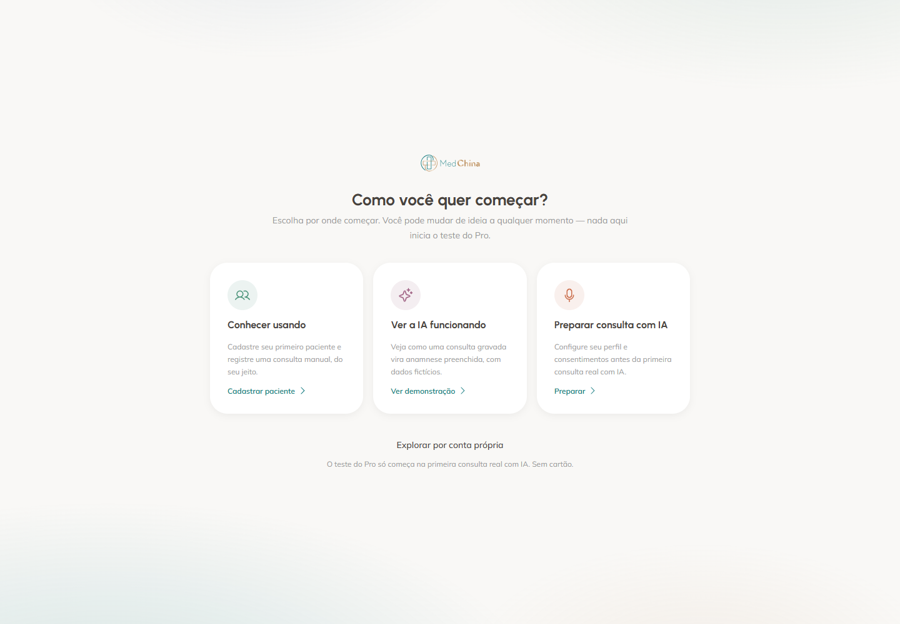
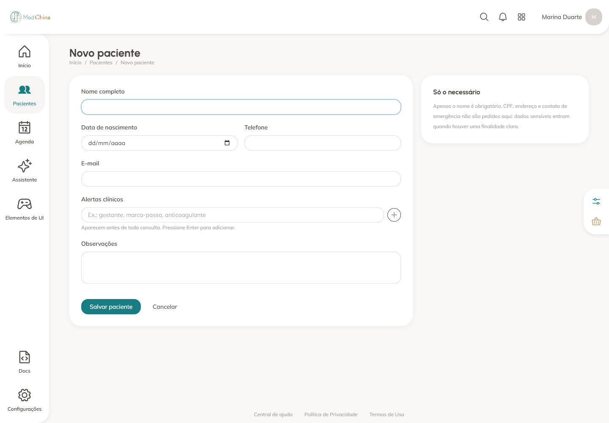
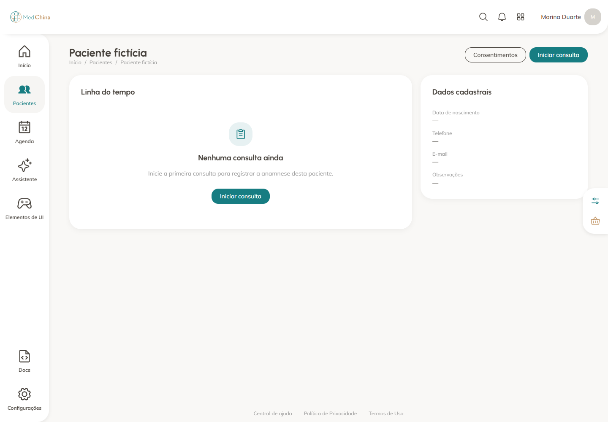
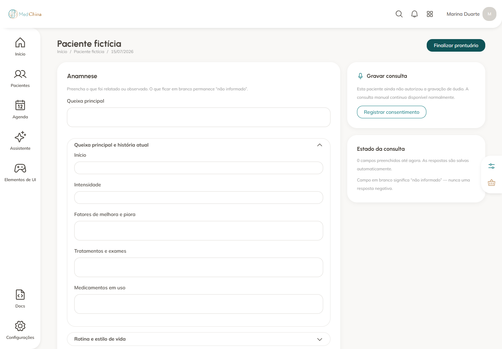
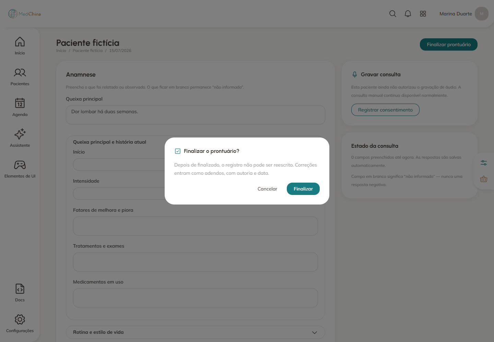
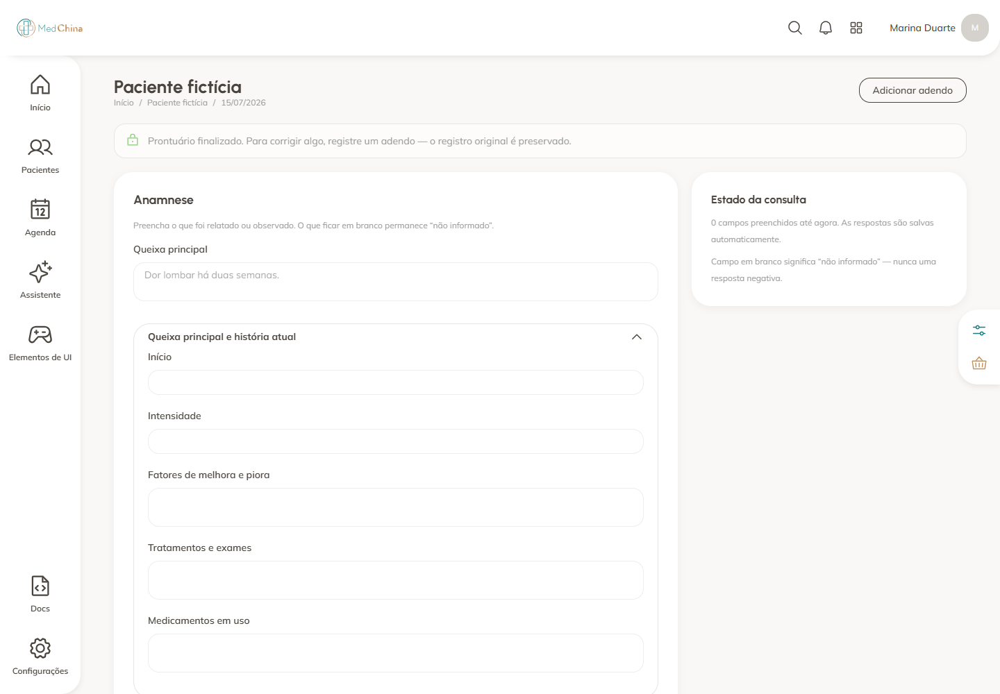
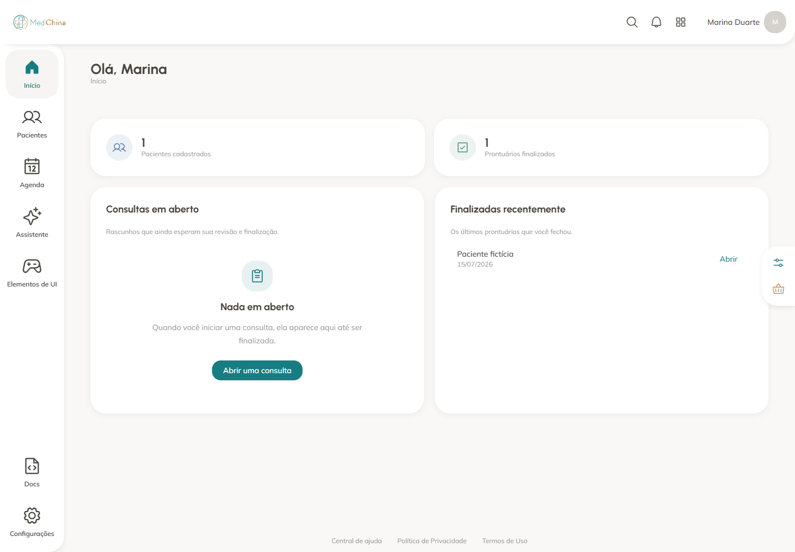

# Auditoria do onboarding — MedChina

Data: 15 de julho de 2026  
Escopo: primeira opção do onboarding, de “Cadastrar paciente” até o retorno ao início.

## Veredito

A primeira tela é clara, mas o onboarding termina no primeiro clique. A partir do cadastro do paciente, o produto passa a exibir telas normais do sistema sem manter contexto, progresso ou orientação. Para uma pessoa leiga, o abandono relatado é previsível — especialmente após finalizar o prontuário, quando o fluxo fica em uma tela bloqueada e não oferece um próximo passo.

Saúde geral do fluxo: **frágil, com um ponto crítico no encerramento**.

## Como a auditoria foi feita

O fluxo real da aplicação foi reproduzido em Chromium, viewport de 1440 × 1000, tema claro e idioma pt-BR. Foi usado um backend Supabase local simulado, com dados fictícios e perfil de navegador isolado. Nenhum dado remoto foi lido ou alterado e nenhum arquivo-fonte do produto foi modificado.

## Fluxo observado

### 1. Escolha inicial — saudável, com ressalvas

A hierarquia visual é boa e a opção “Cadastrar paciente” é compreensível. O problema é a promessa “Você pode mudar de ideia a qualquer momento”: ao escolher uma opção, `welcome` é marcado como concluído e a tela de escolha deixa de ficar acessível. Também não há uma prévia do percurso, por exemplo “3 passos, cerca de 3 minutos”.

### 2. Cadastro do paciente — frágil

O formulário tem um CTA claro e informa que apenas o nome é obrigatório. Porém, o usuário perde completamente o contexto de onboarding: não há “Passo 1 de 3”, indicação do que acontecerá depois ou destaque consistente dos campos opcionais. Itens de desenvolvimento como “Elementos de UI”, “Docs” e controles de tema competem fortemente pela atenção.

### 3. Ficha do paciente — razoável

“Iniciar consulta” é fácil de encontrar e aparece também no estado vazio da linha do tempo. É a melhor transição do percurso. Ainda assim, falta uma confirmação explícita — “Paciente cadastrado. Agora inicie a primeira consulta” — e a ação “Consentimentos”, ao lado do CTA principal, pode sugerir que ela é obrigatória para seguir no fluxo manual.

### 4. Consulta vazia — crítica para primeiro uso

A pessoa chega a uma ficha extensa sem saber quanto precisa preencher, quais campos são essenciais ou qual é o objetivo do teste. “Finalizar prontuário” já está habilitado com zero campos, enquanto o bloco de gravação pede consentimento e introduz uma segunda trilha que não corresponde à opção manual escolhida. O usuário precisa inferir sozinho que pode preencher apenas o que fizer sentido.

### 5. Confirmação de finalização — diálogo bom, regra confusa

O diálogo explica bem que a ação é irreversível e que correções serão feitas por adendos. No entanto, ele permite finalizar uma ficha praticamente vazia e não resume o que será encerrado. Há ainda uma inconsistência visível: a queixa principal foi preenchida, mas o painel lateral continua exibindo “0 campos preenchidos”.

### 6. Prontuário finalizado — ponto crítico de abandono

A finalização funciona e o aviso é claro, mas a tela se torna um beco sem saída: os campos ficam bloqueados, a única ação em destaque é “Adicionar adendo” e não há reconhecimento da conquista nem orientação. Faltam CTAs como “Ir para o início” e “Conhecer a IA”. Este é o ponto que melhor explica a sensação de ficar perdido e querer abandonar o teste.

### 7. Início após o fluxo — correto como dashboard, fraco como conclusão

O dashboard mostra corretamente um paciente e um prontuário finalizado. Como os predicados de ativação já foram satisfeitos, o checklist desaparece por completo. Assim, nem mesmo ao voltar ao início existe uma mensagem de conclusão, indicação do valor alcançado ou recomendação do próximo passo.

## O que funciona bem

- A escolha inicial é visualmente limpa e tem três caminhos distintos.
- O cadastro reduz a barreira ao exigir apenas o nome.
- “Iniciar consulta” é fácil de descobrir na ficha do paciente.
- O diálogo de finalização comunica corretamente a imutabilidade do prontuário.
- O dashboard reflete fatos reais, em vez de marcar progresso por cliques.

## Principais riscos de UX

1. **P0 — Continuidade perdida:** não existe um fio condutor entre escolha, cadastro, consulta e conclusão.
2. **P0 — Encerramento sem saída:** depois da primeira conquista, não há próximo passo nem celebração.
3. **P0 — Recuperação insuficiente:** a escolha inicial não pode ser reaberta e o checklist desaparece ao ser concluído ou dispensado.
4. **P1 — Consulta sem orientação:** formulário longo, sem mínimo recomendado e com finalização disponível desde o início.
5. **P1 — Estado inconsistente:** a queixa principal não entra na contagem de campos preenchidos.
6. **P1 — Distrações internas:** navegação e controles de desenvolvimento reduzem confiança e foco durante o teste.

## Riscos de acessibilidade

A inspeção do código encontrou controles somente com ícone sem nome acessível, rótulos de campos sem associação explícita `htmlFor`/`id`, progresso visual sem semântica de `progressbar` e status de salvamento sem região viva. As capturas também mostram alta densidade de controles e textos auxiliares pequenos. É necessário um teste adicional de teclado, foco, leitor de tela e contraste para confirmar conformidade WCAG; as imagens, sozinhas, não permitem essa conclusão.

## Recomendações priorizadas

1. Manter um cabeçalho compacto e persistente: “Passo 1 de 3 — cadastre um paciente”, “Passo 2 de 3 — inicie a consulta”, “Passo 3 de 3 — finalize o prontuário”.
2. Após cadastrar o paciente, mostrar uma confirmação contextual com CTA direto para a consulta.
3. Criar um modo de primeira consulta: explicar que o usuário pode preencher apenas a queixa principal para experimentar e manter os demais blocos recolhidos.
4. Após finalizar, substituir o beco sem saída por uma conclusão: “Seu primeiro prontuário está pronto”, com “Ir para o início” como ação principal e “Ver a IA funcionando” como próxima exploração.
5. Tornar a escolha inicial reaberta e fazer a retomada apontar diretamente para o paciente ou rascunho em andamento.
6. Contar a queixa principal no progresso e revisar a regra/explicação para finalização vazia.
7. Remover “Elementos de UI”, “Docs” e o configurador visual de ambientes usados por clientes e testes.
8. Corrigir nomes acessíveis, associações de rótulos, semântica de progresso, foco e anúncio de autosave.

## Jornada-alvo

**Escolha → 1/3 Cadastrar paciente → 2/3 Iniciar consulta → 3/3 Finalizar prontuário → Conclusão + próximo caminho**

Essa mudança preserva os predicados reais de ativação já existentes, mas transforma tarefas isoladas em uma história compreensível para quem ainda não conhece o produto.

## Evidências no código

- `apps/web/src/app/onboarding/page.tsx`: a escolha conclui `welcome` e a tela não volta a ser exibida.
- `apps/web/src/lib/onboarding.ts`: progresso baseado em perfil, paciente e consulta finalizada.
- `apps/web/src/components/product/onboarding-checklist-card.tsx`: descrições das etapas são preparadas.
- `apps/web/src/components/product/onboarding-checklist.tsx`: as descrições não são exibidas; há controle de ícone sem nome acessível.
- `apps/web/src/app/(dashboard)/pacientes/novo/page.tsx`: só o nome é obrigatório; rótulos não têm associação explícita com os campos.
- `apps/web/src/app/(dashboard)/consultas/[id]/page.tsx`: a finalização mantém o usuário na mesma tela e não anuncia o autosave por região viva.
- `apps/web/src/menu-items.ts`: itens de UI e documentação ainda aparecem na navegação do produto.

## Limites desta auditoria

- Captura apenas em desktop, tema claro e pt-BR.
- Dados, autenticação e respostas do Supabase foram simulados localmente.
- Não foram testados latência, falhas de rede, gravação real, e-mail, 2FA ou comportamento móvel.
- Acessibilidade completa exige avaliação específica com teclado e tecnologias assistivas.
